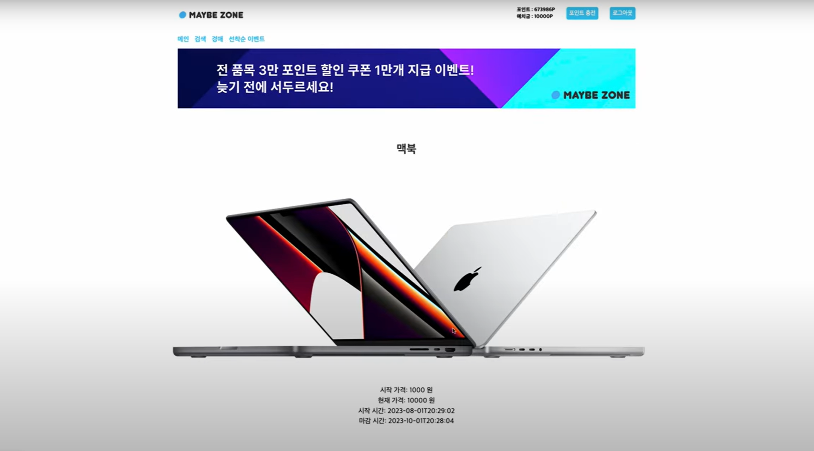

# 게임 소개 및 리뷰 사이트

### 1. 프로젝트 개요

- 팀원 : 유시환, 신윤상, 김광일, 김동현
- 기간 : 2022년 07월 30일 ~ 09월 07일, 6주 간 진행

### 2. 프로젝트 소개

페이지별 주요기능

|페이지|담당지|기능|
|:--|:--|:--|
|경매 조회 페이지|유시환|경매 조회|
|경매 입찰 페이지|유시환|경매 입찰|

### 3. 기술스택

            

### 4. 트러블 슈팅

### 1-1) MSA 설계

- 

### 1-2) 동기,비동기 처리

- 

### 1-3) 동시성 제어

- 

### 1-4) 장애 격리

- 

### 1-5) 분산 추적

- 

### 1-6) 관심사 분리

- 
